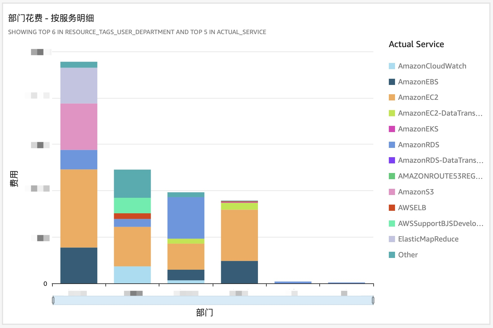
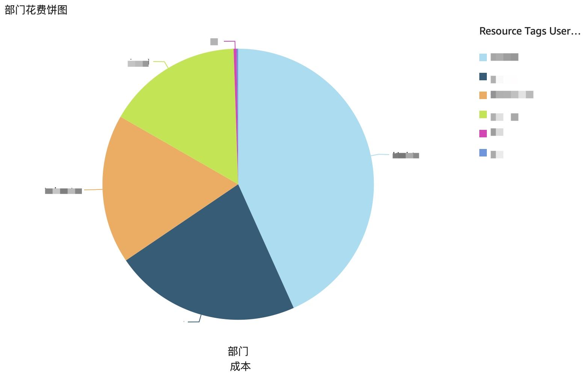
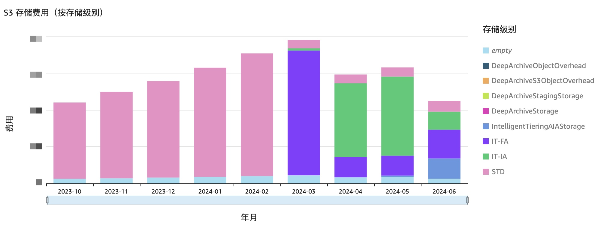
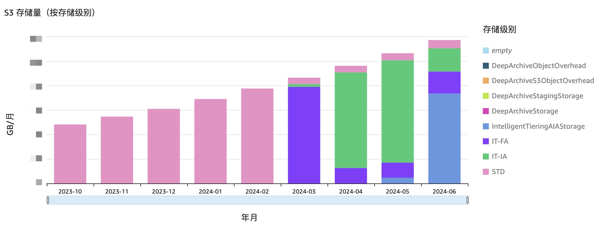

# BetterBill

更有用的 AWS 账单分析。

# 概览

Amazon Cost and Usage Report (CUR) 是 AWS 云使用账单的最新版本。其结构经过重构，并且包含比以前的报告格式更多的数据。

然而，它仍然是一个具有数百列的宽表。每个服务都会重定义某些列，使得跨服务进行统一分析变得非常困难。缺乏详细的字段描述和可能的值也意味着你需要通过大量试验来弄清楚字段的确切语义。

BetterBill 是我对 CUR 报告可用性的改进。基本上，我们解构了宽表，并为服务的字段按意义创建别名，因此您只需查看字段名即可了解其含义。

此外，成本的计算方式也得到了统一。比如，Savings Plans 的计算方式与 Reserved Instance 和 On-Demand 的计算逻辑非常不同，但它们现在都在同一个模型下统一，因此您可以轻松分析 SP、RI 和 On-Demand 的使用情况。

此为个人爱好项目，仅供参考和试用，本人不承担任何使用相关责任。请自行注意任何可能产生的费用以及安全相关的要求。

# 快速开始

- 首先，你需要启用导出 CUR 的功能
  - 在控制台右上角点击进入 Billing 页面， 左侧 Cost Analysis > Data Exports 下，创建导出
  - 选择 Legacy CUR export
    - ❗️如果你找不到上述菜单，请左侧寻找 Cost & usage reports 菜单
    - ❗️注意不同区域的选项顺序可能有不同，请先看完下面的选项
  - 导出名字随意
  - 勾选 Include resource IDs
  - 不勾选 Split cost allocation data（暂不支持）
  - 时间粒度选择 Hourly / 按小时
  - 勾选 Refresh automatically
  - 数据格式，勾选 Parquet
  - 选择导出到 Amazon Athena
  - S3 桶，选择或创建一个均可
  - 稍等片刻，等状态从 In progress → Complete 后，你将可以在你选择的桶内看到 CUR
  - CUR 包括 SQL 文件和数据两部分，其中 SQL 文件可以帮助我们在 Athena 中创建 CUR 外表，下载保存这个 SQL 文件
- 创建 BetterBill 专用数据库
  - 在 Athena 中执行如下 SQL 语句，如果没用过 Athena，需要先创建并设置 Athena 的 S3 结果存储桶，保存这个桶的地址，后续还会用到
    - `CREATE DATABASE betterbill;`
    - 把之前的 SQL 中的数据库名字修改成 `betterbill`，表名字可以自定，保存下这个 CUR 表的名字
- 创建 BetterBill 数据表
  - 编辑 `start.py` 头部的参数
    - 区域名字（`REGION_NAME`）
    - Athena 结果桶地址（`ATHENA_OUTPUT_LOCATION`）
    - 专用数据库名字（`BB_DB`），即前一步你创建的数据库名，默认为 `betterbill`
    - CUR 表（`CUR_TABLE`），即你创建的 CUR 表的名字
  - 运行 `start.py` 即可创建所有的表

# 功能

- 按服务对字段进行语义别名
- 统一的成本计算模型
- RI、SP 被资源使用情况标记
  - 没用完的部分也可以被识别
-（计划中）数据完整性检查，确保转换后的成本正确
-（计划中）在 Amazon QuickSight 中展示使用情况，演示使用 BetterBill 可以实现的功能
-（开发中）一个用于轻松引导/升级 BetterBill SQL 视图到 Athena 的 boto3 脚本

----

# 表和字段介绍

- `bb_bwt_costs` 费用大宽表
  - 注意
    - 如果此条记录不是该服务，则该服务字段为空
  - 综合
    - `bb_service` = 实际服务，EBS 和 EC2 是拆开的
    - `bb_parent_service` = 上级服务，比如 EMR 启动的 EC2 机器，这个值就会是 `AmazonEMR`
    - `bb_cost` = 费用
  - `AmazonEBS`
    - `bb_ebs_volume_id` = 卷 ID，如 `vol-xxxxx`
    - `bb_ebs_volume_type` = 卷类型，比如 `gp3`
    - `bb_ebs_gb_month` = 该条记录对应的卷的使用时长，单位为 GB / 月，可用于统计
  - `AmazonEC2`
    - `bb_ec2_instance_id` = 实例 ID，如 `i-xxxxx`
    - `bb_ec2_instance_class` = 实例级别，如 `m5.xlarge`
    - `bb_ec2_seconds` = 该条记录对应的实例使用时长
    - `bb_ec2_platform` = 计算平台，如 `Graviton` 和 `x86`
    - `bb_ec2_usage_type` = 使用类型，比如 On-Demand、RI、SP
    - 预留实例
      - `bb_ec2_ri_arn` = 如果此条记录是预留实例，其对应的 RI ARN
      - `bb_ec2_ri_term_year` = RI 时长，如 1 年或者 3 年
    - Savings Plans
      - `bb_sp_arn` = 如果此条记录是 SP 使用记录，其对应的 SP ARN
  - `AmazonEMR`
    - `bb_emr_cluster_name` = EMR 集群名字
    - `bb_emr_cluster_id` = EMR 集群 ID
    - `bb_emr_instance_role` = EMR 实例角色，比如 Master、Core、Task
  - `AmazonS3`
    - `bb_s3_gb_month` = 该条记录对应的卷的存储时长，单位为 GB / 月
    - `bb_s3_storage_level` = 存储级别，如 `Standard`、`IntelligentTiering`
    - `bb_s3_request_cost_tier` =  请求费用的等级线，比如前 100w 个是第 1 线（Tier 1），详细参见 S3 收费
    - `bb_s3_num_requests` = 该条记录如果是请求费，其对应的请求次数
    - `bb_s3_bucket` = 费用对应的 S3 桶
    - `bb_s3_cost_type` = 费用类型，有存储费用 `TimedStorage` 和请求费 `Requests` 两种

----

# Amazon QuickSight 看板示例

BetterBill 的核心是拆解了的账单表，可以对接任意支持 Amazon Athena 的 BI 工具来分析和展示。

此处以 Amazon QuickSight 为例，展示我们可以从如何分析账单、设计账单看板。

## 01 总费用

- 按月展示总费用，可以了解整个费用的增长趋势
- 可以展示是否有折扣券冲抵
  - 计算方式：`{line_item_line_item_type} = 'Credit'`

## 02 按部门和业务

- ❗️需要提前打好并激活部门和业务对应的资源标签

### 02_01 部门花费-按服务明细

### 02_02 部门花费-百分比

- 用饼图展示不同部门的花费占比
- 展示没有打标签的花费
  - 可能是共享花费，也可能是需要打标签的花费

## 03 S3 费用

### 03_01 按存储级别看费用

- 看是否开启智能分层，是否生效

### 03_02 按存储级别看存储量

- 看是否开启智能分层，是否生效

